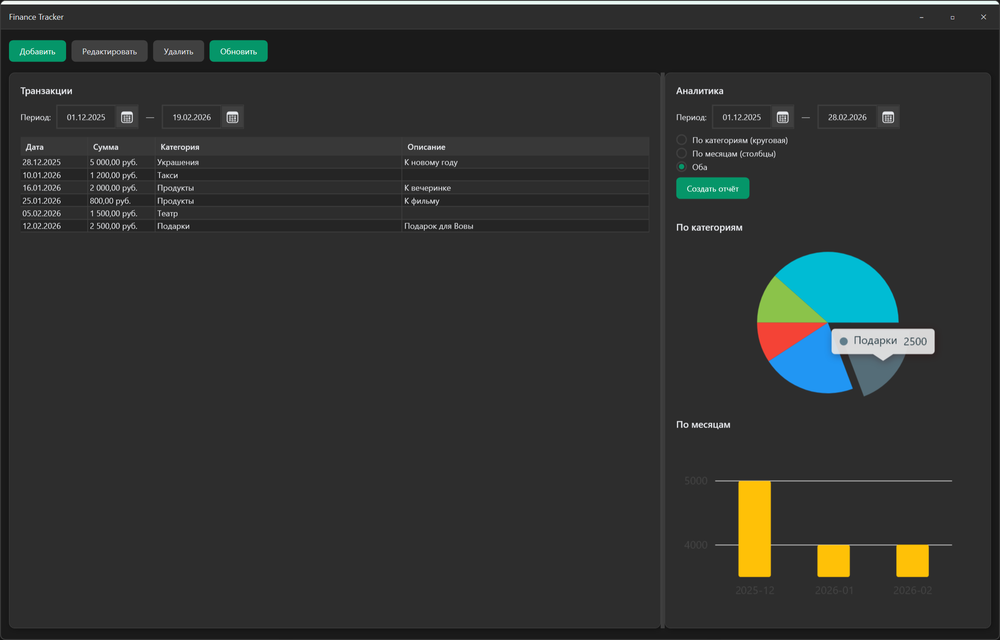

# Finance Tracker

**v1.0**

Десктопное приложение для учёта личных финансов (WPF, SQLite, аналитика на Python).



## Описание (Description)

**Finance Tracker** помогает вести учёт доходов и расходов: добавлять, редактировать и удалять транзакции, фильтровать их по периоду и строить отчёты — круговую диаграмму по категориям и столбчатую по месяцам.

Проект создан как практика разработки на C# и WPF: архитектура MVVM, работа с SQLite, интеграция с Python-скриптом для аналитики и юнит-тесты. Данные хранятся локально в одной базе; отчёты строятся по выбранному периоду.

## Технологический стек (Technologies Used)

- **C# / .NET 8** — основное приложение (WPF)
- **WPF** — интерфейс, тёмная тема, кастомная шапка окна
- **CommunityToolkit.Mvvm** — MVVM, команды и привязки
- **Microsoft.Data.Sqlite** — база данных SQLite
- **LiveCharts2** — графики (круговая и столбчатая диаграммы)
- **Python 3.x + Pandas** — скрипт аналитики (агрегация по категориям и месяцам, вывод JSON)
- **xUnit, Moq, FluentAssertions** — юнит и интеграционные тесты

## Функционал (Features)

- Добавление, редактирование и удаление транзакций (дата, сумма, категория, описание)
- Фильтрация списка по периоду (начало и конец даты)
- Отчёты за выбранный период: круговая диаграмма по категориям и столбчатая по месяцам (через Python-скрипт)
- Локальное хранение в SQLite (файл создаётся при первом запуске)
- Тёмная тема и своя панель заголовка окна (свернуть / развернуть / закрыть)

## Планы развития (Roadmap)

Идеи для расширения функциональности:

- **Справочник категорий** — предустановленный набор категорий (еда, транспорт, развлечения и т.п.) с возможностью добавлять, редактировать и скрывать пользовательские категории.
- **Экспорт данных** — выгрузка транзакций и отчётов в CSV или Excel для дальнейшего анализа или архивации.
- **Планирование и лимиты** — задание месячных лимитов по категориям и уведомления при приближении к лимиту.
- **Повторяющиеся операции** — шаблоны для регулярных доходов и расходов с автоподстановкой при создании транзакции.
- **Резервное копирование** — сохранение и восстановление копии базы данных в один клик.

## Установка и запуск (Installation & Usage)

### Требования

- [.NET 8 SDK](https://dotnet.microsoft.com/download/dotnet/8.0)
- (Опционально) [Python 3.x](https://www.python.org/downloads/) — для кнопки «Создать отчёт». Без Python приложение запускается, но отчёты строить не будет.

### Шаги

1. Клонируйте репозиторий и перейдите в папку с решением (там, где лежит `FinanceTracker.sln`).

2. Запуск приложения:
   ```bash
   dotnet run
   ```
   При первом запуске создаётся база SQLite (в папке приложения).

3. Чтобы работала кнопка **«Создать отчёт»**, установите Python и зависимости:
   ```bash
   pip install -r PythonApp/requirements.txt
   ```
   Рекомендуется использовать виртуальное окружение (venv) в `PythonApp`.

4. Запуск тестов:
   ```bash
   dotnet test
   ```
   Или только тестовый проект:
   ```bash
   dotnet test FinanceTracker.Tests
   ```
